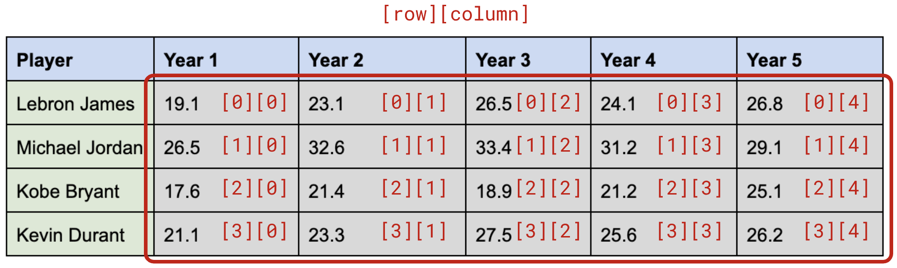

# 4.5 Two-Dimensional Arrays

Not all data can be expressed as lists. Some types of data are best expressed as tables. For example, consider the table of scoring averages for the first 5 years of the following NBA players:

| Player         | Year 1     | Year 2     | Year 3     | Year 4     | Year 5     | 
| -------------- | ---------- | ---------- | ---------- | ---------- | ---------- |
| Lebron James   | 19.1       | 23.1       | 26.5       | 24.1       | 26.8       |
| Michael Jordan | 26.5       | 32.6       | 33.4       | 31.2       | 29.1       | 
| Kobe Bryant    | 17.6       | 21.4       | 18.9       | 21.2       | 25.1       | 
| Kevin Durant   | 21.1       | 23.3       | 27.5       | 25.6       | 26.2       | 

We've seen how arrays can be used to store lists of data.  In Java, arrays can also be used to store tables of data. A list is a **one-dimensional array**, that is, you have a single index to the array that specifies an element's location in a single line.

A table is stored as a **two-dimensional array**:
* Location of an element is specified using two indices, the *row* and the *column*
  * For example, Kobe Bryant's Year 4 scoring average can be considered to be the 3rd row, 4th column.
* Like a one-dimensional array, a single two-dimensional array **can only store one type of value.**

## Declaring a 2D Array
The declaration looks much like a one-dimensional array, except we add a second set of square brackets. 

### Example
Let's consider just the scoring averages of the table above.

To declare a 2D array for this would look like:
```java
double[][] scoringAverages;
```



## Creating a 2D Array
To create the array, the `new` keyword is used, followed by the **base data type**, followed by the **number of rows in square brackets**, followed by the **number columns in square brackets.**

```java
scoringAverages = new double[4][5];
```

## Accessing/Setting Elements in a 2D Array
Elements can be set or referenced in the following manner:
```
array-name[row-value][column-value]
```

### Example
We can set the value of the <ins>first row</ins>, <ins>first column</ins> in our example with:
```java
scoringAverages[0][0] = 19.1;
```

Likewise, we can print this element:
```java
System.out.println(scoringAverages[0][0]);
```

We can now set all the elements of our `scoringAverages` table:

```java
// Lebron James
scoringAverages[0][0] = 19.1;
scoringAverages[0][1] = 23.1;
scoringAverages[0][2] = 26.5;
scoringAverages[0][3] = 24.1;
scoringAverages[0][4] = 26.8;

// Michael Jordan
scoringAverages[1][0] = 26.5;
scoringAverages[1][1] = 32.6;
scoringAverages[1][2] = 33.4;
scoringAverages[1][3] = 31.2;
scoringAverages[1][4] = 29.1;

// Kobe Bryant
scoringAverages[2][0] = 17.6;
scoringAverages[2][1] = 21.4;
scoringAverages[2][2] = 18.9;
scoringAverages[2][3] = 21.2;
scoringAverages[2][4] = 25.1;

// Kevin Durant
scoringAverages[3][0] = 21.1;
scoringAverages[3][1] = 23.3;
scoringAverages[3][2] = 27.5;
scoringAverages[3][3] = 25.6;
scoringAverages[3][4] = 26.2;
```

## Processing 2D Arrays
In previous lessons, we saw that we often need loops to process (e.g. print, find items, count values, compute totals) one-dimensional arrays. When working with two-dimensional array, we often need a **nested loop**, that is, a loop within a loop.

### Example #1 - Basic Printing
```java
System.out.println("BASIC PRINTOUT OF DATA");

for (int row = 0; row < scoringAverages.length; row++) {
  for (int col = 0; col < scoringAverages[0].length; col++) {
    System.out.println(scoringAverages[row][col]);
  }
  System.out.println("");
}
```

<ins>Output:</ins>
```
BASIC PRINTOUT OF DATA
19.1
23.1
26.5
24.1
26.8

26.5
32.6
33.4
31.2
29.1

17.6
21.4
18.9
21.2
25.1

21.1
23.3
27.5
25.6
26.2
```

#### Row & Column Length
* Notice in the outer loop of the above code, we can access the number of **rows** with `scoringAverages.length`
* Notice in the inner loop of the above code, we can access the number of **columns** with `scoringAverages[0].length`

### Example #2 - Row Headers via Related Array
We can add another single array storing player names:
```java
String[] players = {"Lebron James", "Michael Jordan", "Kobe Bryant", "Kevin Durant" };
```

and use it to print out the player names with their appropriate scoring average details.

Let's edit the code above to print out the player names along with their scoring averages:
```java
// Print out with player names
System.out.println("\nBASIC PRINTOUT WITH PLAYER NAMES");

for (int currPlayer = 0; currPlayer < players.length; currPlayer++) {
  // Print out the player name
  System.out.println(players[currPlayer]);

  for (int currYear = 0; currYear < scoringAverages[0].length; currYear++) {
    System.out.print("Year " + (currYear + 1) + ": ");
    System.out.println(scoringAverages[currPlayer][currYear]);
  } 
  System.out.println("");
}
```

<span style="color:red">
<b>NOTE:</b><br>
<ul>
  <li>Outer loop looks at the current player which is the row #</li>
  <li>Inner loop looks at the current year which is the column #</li>
</ul>
</br>
</span>

<ins>Output:</ins>
```
BASIC PRINTOUT WITH PLAYER NAMES
Lebron James
Year 1: 19.1
Year 2: 23.1
Year 3: 26.5
Year 4: 24.1
Year 5: 26.8

Michael Jordan
Year 1: 26.5
Year 2: 32.6
Year 3: 33.4
Year 4: 31.2
Year 5: 29.1

Kobe Bryant
Year 1: 17.6
Year 2: 21.4
Year 3: 18.9
Year 4: 21.2
Year 5: 25.1

Kevin Durant
Year 1: 21.1
Year 2: 23.3
Year 3: 27.5
Year 4: 25.6
Year 5: 26.2
```

### Example 3 - Formatted Table
We can use the `System.out.printf()` to achieve a properly formatted table:
```java
// Print out a nice formatted table
System.out.println("FORMATTTED");

// Print the column headers
System.out.printf("%15s", "");
for (int year = 1; year <= scoringAverages[0].length; year++) {
   System.out.printf("%10s", "Year " + year);
}
System.out.println("");

// Print out the row details
for (int currPlayer = 0; currPlayer < players.length; currPlayer++) {
   // Print out the player name
   System.out.printf("%15s", players[currPlayer]);

   for (int currYear = 0; currYear < scoringAverages[0].length; currYear++) {
       System.out.printf("%10.1f", scoringAverages[currPlayer][currYear]);
   }
   System.out.println("");
}
```

<ins>Output:</ins>


### Example #4 - Processing Data
Use the `E4ProcessingData.java` file to write your solutions to the following problems:

**a) What is the overall scoring average of the data in the scoring average table?**

**b) What is value of the highest scoring average in the table? What year was it? which player?**

**c) Which player had the highest scoring average after 5 years of play?**

**d) What year yielded the highest total scoring average?**